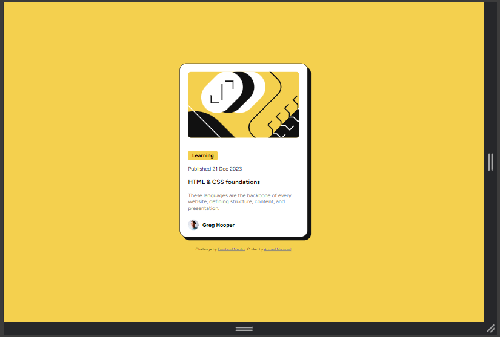
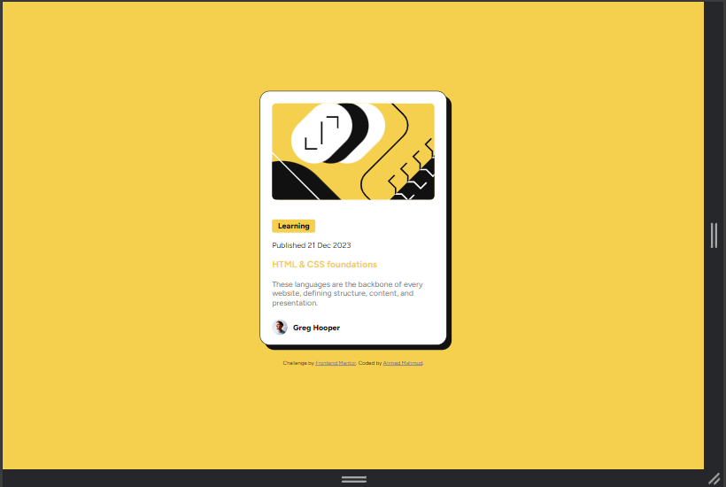
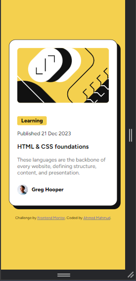

# Frontend Mentor - Blog preview card solution

This is a solution to the [Blog preview card challenge on Frontend Mentor](https://www.frontendmentor.io/challenges/blog-preview-card-ckPaj01IcS). Frontend Mentor challenges help you improve your coding skills by building realistic projects. 

## Table of contents

- [Frontend Mentor - Blog preview card solution](#frontend-mentor---blog-preview-card-solution)
  - [Table of contents](#table-of-contents)
  - [Overview](#overview)
    - [Screenshots](#screenshots)
    - [Links](#links)
  - [My process](#my-process)
    - [Built with](#built-with)
    - [What I learned](#what-i-learned)
    - [Continued development](#continued-development)
    - [Useful resources](#useful-resources)
  - [Author](#author)
  - [Acknowledgments](#acknowledgments)

## Overview

<!-- ### The challenge

Users should be able to:

- See hover and focus states for all interactive elements on the page -->

### Screenshots

<br>Desktop 

<br>Desktop Active State

<br>Mobile

### Links

- Solution URL: [Github](https://github.com/dDevAhmed/blog_preview_card)
- Live Site URL: [Github Pages](https://ddevahmed.github.io/blog_preview_card/)

## My process

### Built with

- Semantic HTML5 markup
- CSS custom properties
- Flexbox
- CSS Grid
- Mobile-first workflow

### What I learned

Working on the Blog Preview Card project provided me with valuable insights and reinforced several important front-end development concepts:

1. **Flexbox for Layout**: I improved my proficiency with Flexbox, which allowed me to create a responsive and flexible layout for the card. Flexbox's ability to distribute space and align items within a container was essential for achieving the desired design.
2. CSS Custom Properties: I utilized CSS custom properties (variables) to manage styles more efficiently. This practice made it easier to maintain consistency and implement global changes quickly.

```css
:root {
    --yellow: hsl(47, 88%, 63%); /*primary*/
    --white: hsl(0, 0%, 100%);
    --grey: hsl(0, 0%, 50%);
    --black: hsl(0, 0%, 7%);

    --paragraph-font-size: 16px; /*paragraph*/
}

body {
    background-color: var(--yellow);
}
```

3. Hover and Focus States: I implemented hover and focus states for interactive elements to enhance the user experience. This included changing colors and adjusting other styles when users interact with elements.

```css
.content .title:hover{
    color: var(--yellow);
}
```

### Continued development

In future projects, I plan to continue focusing on:

- Enhancing accessibility through improved semantic HTML and ARIA roles.
- Expanding my knowledge of CSS Grid for more complex layouts.
- Exploring CSS animations and transitions to add more interactivity.
- Refining my mobile-first design skills to ensure better responsiveness across devices.

### Useful resources

- [W3Schools](https://www.w3schools.com/) - Great resource for revisiting basic concepts and getting quick references.
- [ChatGPT](https://www.google.com/url?sa=t&source=web&rct=j&opi=89978449&url=https://chat.openai.com/&ved=2ahUKEwi4pJXa25qGAxVwWEEAHUJBACEQFnoECAYQAQ&usg=AOvVaw139HWUX4D802zbDuJCdFg9) - Helpful for generating code snippets and getting explanations.

## Author

- Website - [Ahmed Mahmud](https://ddevahmed.github.io/)
- Frontend Mentor - [@dDevAhmed](https://www.frontendmentor.io/profile/dDevAhmed)
- Twitter - [@dDevAhmed](https://x.com/dDevAhmed)

## Acknowledgments

I'd like to thank the following:

- [Frontend Mentor](https://www.frontendmentor.io/) for providing this challenge and the resources.
- The challenge author [Frontend Mentor](https://www.frontendmentor.io/), for designing this project.
- My friends and family for their support and encouragement.

By working on this challenge, I have significantly improved my front-end skills and gained more confidence in building responsive web components.
